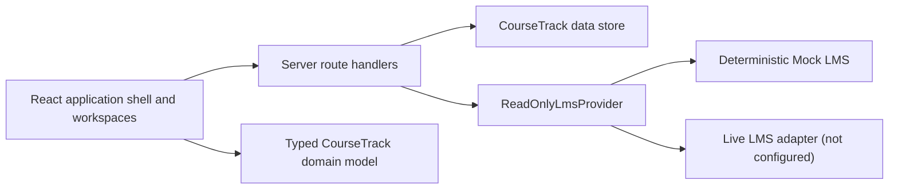
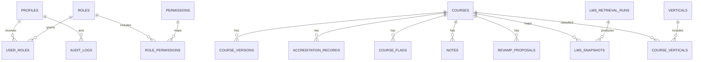

# CourseTrack architecture and delivery plan

## Repository assessment

The repository began as a minimal vinext/Cloudflare starter. It had no domain
model, application routes, production UI, or business integrations. The current
foundation adds a complete vertical slice while retaining the starter's
deployable Cloudflare worker shape.

The source workbook in `Files/` is treated as a read-only discovery artifact.
Its headers informed the import map; it is never altered or treated as a live
database.

## Technical architecture

- The UI reads from typed domain objects and calls same-origin APIs for internal
  writes and LMS retrieval requests.
- Internal writes are validated server-side and limited by centralized
  permissions.
- LMS integrations implement a query-only interface. No create, update, delete,
  publish, or assignment methods exist in the contract.
- Successful LMS retrievals are normalized into immutable snapshots. Failed
  retrievals preserve the most recent successful snapshot.
- The deployable demo uses D1. The production migration targets
  PostgreSQL/Supabase and adds row-level security.

## Entity relationship model

## Initial table set

1. Identity and authorization: `profiles`, `roles`, `permissions`,
   `user_roles`, `role_permissions`.
2. Portfolio: `verticals`, `courses`, `course_verticals`, `course_versions`,
   `accreditation_records`.
3. Internal workflow: `course_flags`, `notes`, `revamp_proposals`.
4. Integration and provenance: `lms_retrieval_runs`, `lms_snapshots`.
5. Accountability: `audit_logs`.

The canonical column-level design is in
[`database-schema.md`](database-schema.md) and the executable migration is
`supabase/migrations/202607300001_phase1_foundation.sql`.

## Permission strategy

Authorization is deny-by-default. UI affordances improve usability but are not
the security boundary; APIs and database policies enforce permissions again.
The initial role set is:

- Administrator
- Course Manager
- Instructional Designer
- Accreditation Reviewer
- Reporting User
- Read-Only User

See [`permissions.md`](permissions.md) for the permission matrix.

## Sample-data strategy

- Generate exactly 64 stable course records—eight for each of eight verticals.
- Use a fixed reference date so review and accreditation queues remain
  deterministic.
- Deliberately include healthy, warning, stale, failed, and incomplete records.
- Mark every generated record with `isSample`, `dataSource`, and `sourceSystem`.
- Never blend sample data with a live provider without a visible environment
  label.

## Mock-provider strategy

The mock provider implements the same read-only interface as a future live
provider and supports three deterministic modes:

- `healthy`: all records retrieved.
- `warnings`: partial success with explicit mapping warnings.
- `outage`: retrieval fails while the previous snapshot stays active.

Live API endpoint shapes and response fields are not guessed. The placeholder
adapter reports `not-configured` until documentation and credentials are
available.

## Delivery phases

### Phase 1 — foundation and portfolio vertical slice

- Architecture, schema, RLS, roles, and provenance
- Responsive shell, dashboard, library, and course detail
- Deterministic sample data and mock LMS provider
- D1 demo persistence plus Supabase production migration
- Build, contract, and rendered-output tests

### Phase 2 — production identity and ingestion

- Connect Supabase Auth and database runtime
- Implement the documented live LMS adapter
- Add scheduled retrievals, retry policy, incremental cursors, and alerts
- Add controlled workbook import jobs with row-level validation reports

### Phase 3 — workflow hardening

- Approval workflows, notification routing, richer audit views
- Browser end-to-end, accessibility, and performance regression suites
- Fine-grained organization/vertical scopes and data-retention controls

### Phase 4 — analytics and operations

- Saved server-side reports and scheduled exports
- Trend snapshots, portfolio forecasting, and operational service levels
- Runbooks, recovery tests, and production observability

## Assumptions

- CourseTrack is the system of record only for internal portfolio metadata.
- The LMS remains authoritative for LMS-owned course fields.
- Authentication identifies a person; authorization is resolved by CourseTrack
  roles.
- Soft archive is preferred over destructive course deletion.
- A future live LMS supports read APIs and server-side authentication, but its
  exact capabilities are unknown.

## Risks and mitigations

| Risk | Mitigation |
| --- | --- |
| LMS fields or pagination differ from expectations | Keep provider mapping isolated; do not invent endpoints |
| Stale data is mistaken for current data | Show source, retrieval status, and timestamp near LMS fields |
| A failed retrieval erases useful data | Store immutable snapshots and promote only successful retrievals |
| UI role checks are bypassed | Re-check permissions in APIs and RLS |
| Spreadsheet values contain formulas or malformed dates | Map explicitly, validate rows, and neutralize formula-leading exports |
| Demo storage diverges from production | Keep domain/provider boundaries neutral and maintain a canonical Supabase migration |

## Recommended migration order

1. Identity, roles, permissions, and helper functions.
2. Verticals and courses.
3. Versions, accreditation, flags, notes, and revamp proposals.
4. Retrieval runs and immutable snapshots.
5. Audit logs and indexes.
6. RLS enablement and policies.
7. Reference role, permission, and vertical seed records.
